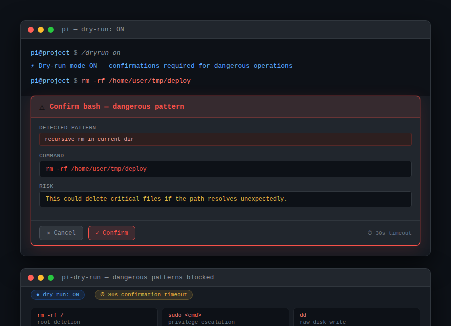

# pi-dry-run

> **One confirmation between pi's plan and pi's irreversible action.**



Every agent has the moment — the `rm -rf` you didn't mean, the `.env` overwrite that wiped credentials, the `sudo shutdown` that wasn't a joke. pi-dry-run is the gate.

## Install

```bash
pi install git:github.com/Ola-Turmo/pi-dry-run
```

Restart pi to activate.

## Usage

```bash
/dryrun on       # Enable confirmation mode
/dryrun off      # Disable
/dryrun status   # Check current state
```

Or call it as a tool:

```
→ DryRunToggle({ action: "on" })
```

Default is **off** on first load. To enable by default, add to your `~/.pi/agent/AGENTS.md`:

```
You have pi-dry-run installed. Always enable dry-run mode at the start of each session.
```

## What it blocks

| Pattern | Why it's dangerous |
|---|---|
| `rm -rf /` | root deletion |
| `rm -rf ./` | current-dir deletion |
| `sudo <cmd>` | privilege escalation |
| `dd` | raw disk write |
| `curl \| sh` / `wget \| sh` | trust-and-execute |
| `mkfs`, `fdisk`, `wipefs` | filesystem destruction |
| `shutdown`, `reboot` | system shutdown |
| `> /dev/<device>` | device write |
| `chattr -i` | immutable flag removal |
| `chmod 777 /` | overly permissive |
| `: > /path` | silent file overwrite |
| write `.env`, `.pem`, `~/.ssh/` | credential overwrite |

Dangerous bash patterns always require confirmation. Writes and edits to sensitive paths always require confirmation. Other bash commands show a one-time warning.

In RPC/print mode, dangerous patterns are logged but no dialog appears — there's no user to confirm anyway.

## Requirements

- pi v0.60.0+
- Node.js 18+

## Uninstall

```bash
pi uninstall git:github.com/Ola-Turmo/pi-dry-run
```

## License

MIT
